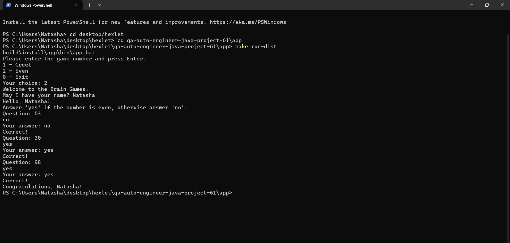
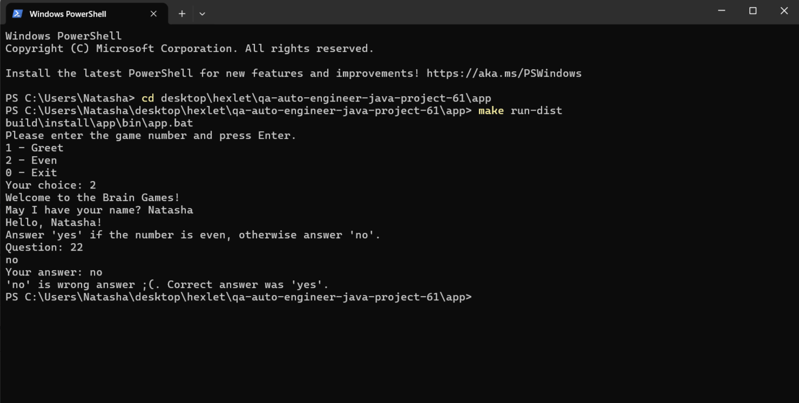
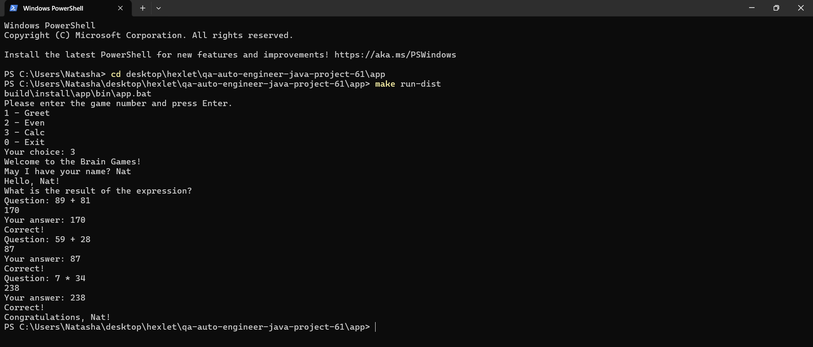
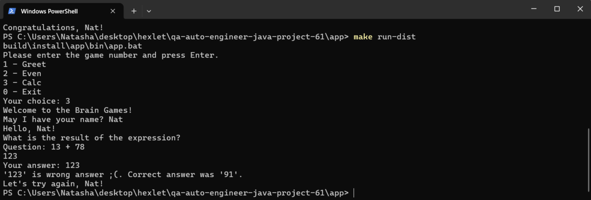
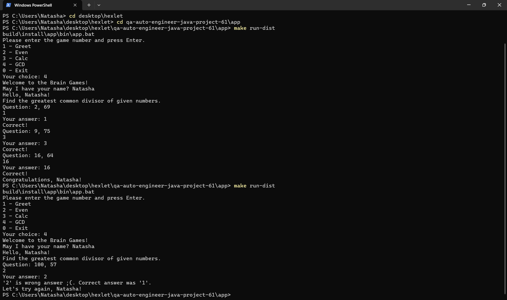

### Hexlet tests and linter status:

### SonarQube
Brain Games

 
   
 

### Even game demo
Successful game:

Failed game:

### Calc game demo
Successful game:

Failed game:

### GCD game demo
Successful and failed game:

